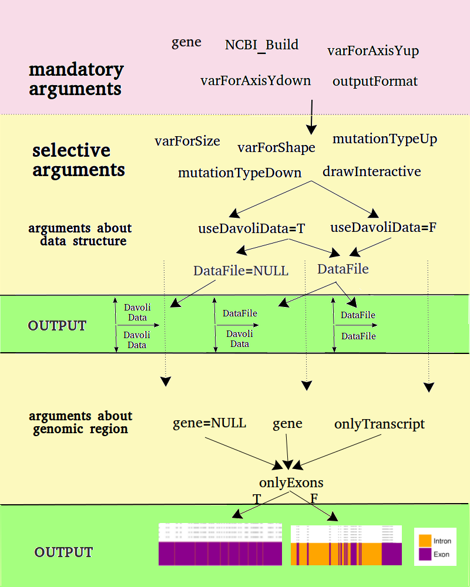

# mutationPlot
======Prerequisites=====

```R
library(biomaRt)
library(ggplot2)
library(gtable)
library(grid) 
require(ggthemes)
library(FRACTION)
library(IRanges)
library(plyr)
library(plotly)
require(stats)
```

=====Usage Examples=====

```R
source("mutationPlot.R")

mutationPlot(NCBI_Build = "37", varForAxisYup = varForAxisYup, varForAxisYdown = varForAxisYdown, drawOnlyTranscript = FALSE, outputFormat = "ps", mutationTypeDown=c("Nonsense","Frameshift"), mutationTypeUp=c("Nonsense","Frameshift"), onlyExons=FALSE, databaseUp = "ExAC Data,", databaseDown = "Somatic Mutation Data,", useDavoliData=TRUE, DataFile="selected_AC_Missene.csv", typeOfGeneName = "hgnc", gene="BRCA2")

mutationPlot(NCBI_Build = "37", varForAxisYup = varForAxisYup, varForAxisYdown = varForAxisYdown, varForShape="LOF", drawOnlyTranscript = FALSE, outputFormat = "ps", mutationTypeDown=c("Nonsense","Frameshift"), mutationTypeUp=c("Nonsense","Frameshift"), onlyExons=TRUE, databaseUp = "ExAC Data,", databaseDown = "Somatic Mutation Data,", useDavoliData=TRUE, DataFile="selected_AC_Missene.csv", typeOfGeneName = "hgnc", gene="BRCA2", drawInteractive=TRUE)

mutationPlot(NCBI_Build = "37", varForAxisYup = "counts", varForAxisYdown = "counts", drawOnlyTranscript = FALSE, outputFormat = "ps", mutationTypeDown=c("Nonsense","Frameshift"), mutationTypeUp=c("Missense"), onlyExons=TRUE, databaseUp = "Somatic Mutation Data,", databaseDown = "Somatic Mutation Data,", typeOfGeneName = "hgnc", gene="ARID1A", drawInteractive=TRUE)
```

<br />
<br />


======Description=======

This tool is implemented in R language. Only requirement for input file is to be in tabulation 
delimited named columns. There was specific function written to process somatic mutation data 
set,  since it did not fulfill this requirement. For a plot drawing ggplot2 library was used. The plot consist of three plots, which were stacked onto each other. In the middle plot genomic information (boundaries of gene or transcript, positions of exons and introns) is depicted. Two side plots are dedicated for two data sets or for the one data set, which is splitted according to selected mutations. All three plots uses the same x axis, which shows position in genome. Variables for y axis should be passed for the both side plots, as two independent parameters. 

The tool is highly parametrized. Only four parameters are mandatory. These are number of human genome assembly (NCBI\_Build), variables for y axis in upper and lower plots (varForAxisYup, varForAxisYdown) and output format (outputFormat), which can be sellected as PS or EPS. Tool can 
opperate with Genome Reference Consortium 37 or 38 version of human genome assembly. Although tool works without specifying gene or genes as a vector, it is recommended to specify it though (using parameter - gene). If gene is not specified, all genes in the file are plotted. This feature can sometimes be useful, if one has small file with genes for plotting. Genes for ploting can be selected by providing vector with their names whether in HUGO Gene  Nomenclature Committee (HGNC) or whether in Ensembl format. It is possible to illustrate one variable varying the size of data points, providing the name of that variable as parameter varForSize. Also one categorical variable can change shapes of data points, by providing varForShape. Parameters varForAxisYup, varForAxisYdown, varForSize, varForShape must match any of column names in input data file.

The tool is prepared for analysis of somatic mutation data provided by T. Davoli group. Logical parameter useDavoliData indicates, if these data should be used. If the name of additional file is provided (DataFile), the data set from this file is analyzed in the upper part of plot. If useDavoliData is set to be TRUE, lower plot is reserved for somatic mutation data. If it is FALSE, DataFile is analysed in both plots. If DataFile is not specified, Davoli data is analysed in both sections. Also the type of mutation can be specified in plots. If it is not provided, all mutations, which are present in the file, are depicted. The option drawInteractive generates two interactive plots in HTML file format. For this urpose R plotly library was used. These files represents upper and lower plots. Tool can also draw mutations for all transcripts in the provided external file, if the information about transcripts is provided in the input file (option - onlyTranscript). Since all mutations having influence to protein function are in exons, tool provides onlyExons parameter, which removes all intronic positions and leaves only marks, where the introns were. Gene and exon positions are derived from Ensembl BioMart 
service (http://www.ensembl.org/biomart/martview/) using R biomaRt library.


